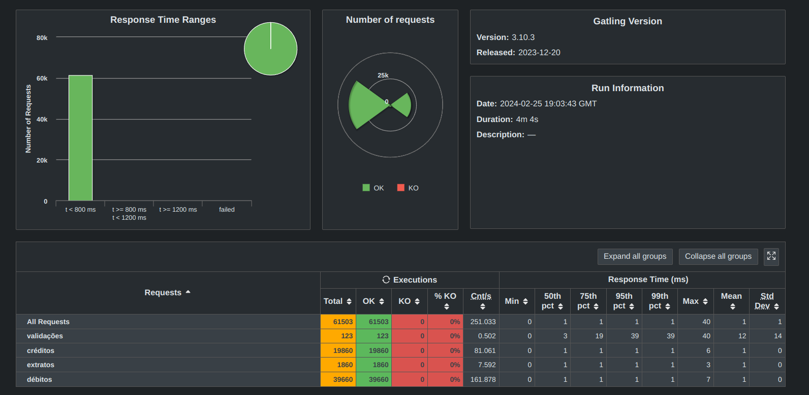

# rinha-backend-2024 Q1 (Saitama Version)


Projeto Java para a [Rinha de Backend 2024 Q1](https://github.com/zanfranceschi/rinha-de-backend-2024-q1).

[Repositório](https://github.com/rafaeltorquato/rinha-backend-2024/tree/saitama) com os fontes **branch saitama**.

**Saitama Version** - Versão que prioriza velocidade.

## Antes de começar
Dada as premissas da rinha, algumas decisões foram tomadas para deixar o projeto mais performático possível. 
Certas decisões não seriam tomadas em um projeto real, principalmente em projetos que tratam transações financeiras.

## Stack

* Java 21.0.2 Native image GraalVM;
  * Virtual Threads;
* Framework Quarkus (latest);
* PostgreSQL (latest);
  * Stored Procedures;
* JDBC;

## Executando o projeto
Build (caso queira alterar algo e recompilar):
```shell script
./mvnw clean package -Pnative && docker build -f src/main/docker/Dockerfile.native-micro --platform linux/amd64 -t rafaeltorquato/rinha-backend-2024-q1-saitama .
```
Run:
```shell script
docker compose up
```

## Resultado
A imagem abaixo contém o resultado da execução do gatling (25/02/2024) em um Ryzen 9 5900X 12 cores 24 threads, 64GB RAM DDR4 3600, NVME Gen 3.



## Contato
* [E-mail](mailto:rafaeltorquat0@prontonmail.com)
* [Linkedin](https://www.linkedin.com/in/rafaeltorquato/)
